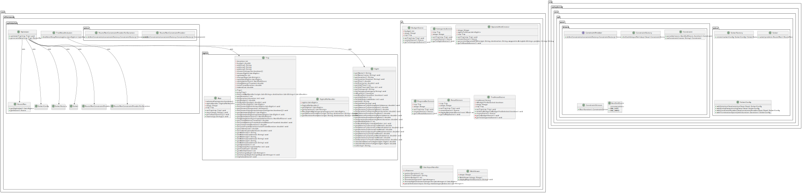

## Οδηγίες μεταγλώττισης του προγράμματος (π.χ. mvn)
Η μεταγλώττιση του προγράμματος γίνεται με την εντολή mvn compile μέσα στο root folder AthensEase.

## Οδηγίες εκτέλεσης του προγράμματος (π.χ. java -jar MazeRun.jar)
Λόγω προβλήματος που αντιμετωπίσαμε με διαφορετικούς υπολογιστές και περιβάλλοντα εκτέλεσης στη σωστή διαχείριση ορισμένων dependencies της βιβλιοθήκης OptaPlanner, η εφαρμογή δεν μπόρεσε να γίνει packaged σε jar file. Για το λόγο αυτό, στην παρούσα φάση η εκτέλεση γίνεται μέσω Maven με την ακόλουθη εντολή: mvn javafx:run

## Οδηγίες Χρήσης του Προγράμματος

### Γενικά
Το πρόγραμμα απευθύνεται σε τουρίστες που επισκέπτονται την Αθήνα. Ο χρήστης δίνει ορισμένες βασικές πληροφορίες για τη διαμονή του, επιλέγει τα αξιοθέατα που θέλει να επισκεφτεί και λαμβάνει τη βέλτιστη διαδρομή που θα ακολουθήσει (ανά μέρα) σε λίστα και χάρτη.

### Εισαγωγή Δεδομένων
Έχουν πραγματοποιηθεί όλοι οι απαραίτητοι έλεγχοι σε κάθε στάδιο εισαγωγής δεδομένων για τη σωστή εισαγωγή.
- Η διεύθυνση διαμονής πρέπει να εισάγεται στα Αγγλικά. Αν κάποια διεύθυνση δεν γίνεται δεκτή, δοκιμάστε να την γράψετε σε πλήρη μορφή (με ΤΚ, Περιοχή).
- Ανάλογα με τις κατηγορίες που επιλέξετε, θα εμφανιστούν τα αντίστοιχα αξιοθέατα προς επιλογή.
- Για κάθε αξιοθέατο εμφανίζονται βασικές πληροφορίες και ένας σύνδεσμος από το TripAdvisor για περισσότερα.
- Αφού επιλέξετε αξιοθέατα, ο χρήστης διαλέγει βελτιστοποίηση ως προς χρόνο ή απόσταση, πατώντας το αντίστοιχο κουμπί. Έπειτα πατά το κουμπί Optimize.

### Αποτελέσματα
Μόλις ολοκληρωθεί η βελτιστοποίηση, εμφανίζεται μια ανασκόπηση της διαδρομής με βασικές πληροφορίες.
- Εμφανίζεται μια λίστα με τα επιλεγμένα αξιοθέατα στη βελτιστοποιημένη σειρά επίσκεψης και χωρισμένα ανά μέρα διαμονής. Ο χωρισμός σε ημέρες γίνεται με βάση τον χρόνο θέασης (υποθετώντας 8 ώρες διαθέσιμες ανά ημέρα).
- Δίπλα από κάθε ημέρα υπάρχει κουμπί "View Map", το οποίο ανοίγει σε browser έναν διαδραστικό χάρτη με τα αξιοθέατα της συγκεκριμένης ημέρας. Απεικονίζεται η διαδρομή που θα κάνει ο τουρίστας εκείνη την ημέρα, ξεκινώντας από το ξενοδοχείο και καταλήγοντας πίσω σε αυτό.

## Παρουσίαση της Δομής των Περιεχομένων του Αποθετηρίου

### Περιεχόμενα και Δομή
Το αποθετήριο ακολουθεί την τυπική δομή του Maven.

#### Σχήμα
Οι κλάσεις είναι οργανωμένες σε 4 πακέτα ανάλογα με τη λειτουργία τους:
- **dataretrieval**: επικοινωνία με το GoogleMaps API και διαχείριση των δεδομένων
- **optimization**: περιέχει την υλοποίηση του αλγορίθμου βελτιστοποίησης με χρήση της βιβλιοθήκης Optaplanner
- **sights**: κλάσεις Sights και Trip που χρησιμοποιούνται από όλο το πρόγραμμα, καθώς και μια βοηθητική κλάση
- **ui**: κλάσεις για το GUI και κλάση TripPlanner με μέθοδο main που ξεκινά το πρόγραμμα

Επιπλέον, στον φάκελο `/src/tests` βρίσκονται τα test με JUnit.
Στον φάκελο `/src/main/resources` βρίσκονται τα αρχεία που χρησιμοποιεί το πρόγραμμα.
Υπάρχουν αρχεία `Readme.md`, `pom.xml` και `gitignore` με τις αντίστοιχες λειτουργίες.

#### Πολλαπλά Branches
**Προσοχή:** Το Repository περιέχει 20 branches. Καθένα από αυτά περιέχει παλαιότερες εκδοχές του κώδικα και μπορεί να διαγραφεί. Τα branches έχουν διατηρηθεί για λόγους παρουσίασης της δουλειάς των μελών, όπως αναλύεται παρακάτω. Για την κατανόηση, εκτέλεση και συντήρηση του προγράμματος δεν απαιτείται η μελέτη κανενός branch εκτός από το main, το οποίο περιέχει το ολοκληρωμένο πρόγραμμα.

### Παρουσίαση Δουλειάς Ανά Μέλος Ομάδας
Λόγω μη εξοικείωσης με το GitHub Workflow, δημιουργήθηκαν υπερβολικά πολλά branches, ενώ πολλά merge γίνονταν τοπικά και ανέβαιναν στο main branch ως ένα τεράστιο push όταν όλα ήταν έτοιμα.
Επειδή το main branch δεν αντικατοπτρίζει τις ατομικές συνεισφορές, σας προτείνουμε να τις εξετάσετε ως εξής:
- Λίστα με όλα τα commits ανά author: `git shortlog -s -n --all`
- Commits ανά μέλος: `git log --all --author="<author name μέλους>"`

#### Μέλη και Author Names:
- Φερενίκη Αγγελέτου --> agfereniki
- Έλενα Χονδροπούλου (8230163) --> Elena Chondropoulou
- Λυδία Χάρη (8230159) --> Lydia Chari
- Κυριακή Κριμιτζά (8230066) --> Kyriaki Krimitza + kiriakikrimitza
- Ανδρέας Νικόλαος Κυπριανού (8230224) --> AndreasKy Kyprianou
- Γιώργος Μοσχόβης (8230098) --> GeorgeMoschovis
- Ευάγγελος Σταύρου --> EvaggelosCodes
- Οδυσσέας Κερασαρίδης (8230057) --> Odysseas Kerasaridis

Ακόμα, ορισμένα μέλη ανέλαβαν επιπλέον ρόλους ως εξής:
- Φερενίκη Αγγελέτου: Δημιουργία των παρουσιάσεων
- Έλενα Χονδροπούλου: Συμμετοχή σε παρουσίαση και δημιουργία προωθητικού βίντεο
- Λυδία Χάρη: Δημιουργία προωθητικού βίντεο και Σχεδιασμός εφαρμογής 
- Γιώργος Μοσχόβης: Δημιουργία Μουσικής για το προωθητικό βίντεο
- Κυριακή Κριμιτζά: Σχεδιασμός Εφαρμογής και Προσχέδιο Οθονών UI
- Ανδρέας Νικόλαος Κυπριανού: Διαγράμματα UML και μετρικές κώδικα
- Οδυσσέας Κερασαρίδης: Συντονισμός Έργου

## Διάγραμμα UML Σχετικά με τον Σχεδιασμό του Κώδικα
Ακολουθεί το διάγραμμα UML.

## Επισκόπηση των δομών δεδομένων και των αλγορίθμων που χρησιμοποιεί η εφαρμογή.

### Δεδομένα
Οι αποστάσεις (και ο χρόνος μετακίνησης) μεταξύ των 32 αξιοθέατων της εφαρμογής έχουν συλλεχθεί από το GoogleMapsAPI και αποθηκευτεί στο αρχείο `distances.json`.
Επιπλέον, στοιχεία για κάθε αξιοθέατο, όπως η κατηγορία του, το κόστος εισιτηρίου, η διάρκεια θέασης και άλλα, έχουν συλλεχθεί και αποθηκευτεί στο αρχείο `sights.json`.
Τα αρχεία αυτά διαβάζονται από το πρόγραμμα και μετατρέπονται σε αντικείμενα τύπου Sight, τα οποία διαχειριζόμαστε μέσω λιστών.
Η απόσταση του κάθε αξιοθέατου από τη διεύθυνση του χρήστη υπολογίζεται κάθε φορά καλώντας το GoogleMapsAPI.

### Αλγόριθμοι
Η βελτιστοποίηση της διαδρομής γίνεται με τη χρήση της βιβλιοθήκης Optaplanner, η οποία επιλέγει αυτόματα τον κατάλληλο αλγόριθμο κάθε φορά.
Έπειτα, χρησιμοποιείται ένας απλός αλγόριθμος για τον χωρισμό της διαδρομής σε ημέρες με βάση τη διάρκεια θέασης των αξιοθέατων.
Το παραγόμενο αποτέλεσμα είναι αρκετά ικανοποιητικό.
**Προσοχή:** Ο χρόνος και οι αποστάσεις πάνω στις οποίες γίνεται η βελτιστοποίηση είναι υπολογισμένες για μετακίνηση με αυτοκίνητο.

## Προσθήκες που σκοπεύουμε να υλοποιήσουμε στο μέλλον

1. Υποστήριξη ΜΜΜ
2. Υποστήριξη πολλαπλών γλωσσών
3. Ζωντανή επικοινωνία με GoogleMapsAPI ώστε να ενσωματόνονται ώρες λειτουργίας αξιοθεάτων και Μεσων Μεταφοράς
4. Ενσωμάτωση Chatbot που θα δίνει πληροφορίες για διαδρομές και αξιοθέατα
5. Ένσωμάτωση δεδομένων καιρού ώστε να λαμβάνονται υπόψη στην βελτιστοποίηση σε πολυήμερα ταξίδια (π.χ. να μην προτείνει να πάει κάποιος πεζοπορεία στον Λυκαβηττό μια βροχερή μέρα)
6. Ενσωμάτωση στο πρόγραμμα προτάσεις για τοπικές επιχειρήσεις (καφέ,εστιατόρια κλπ.) με τις οποίες θα συνεργαζόμαστε
